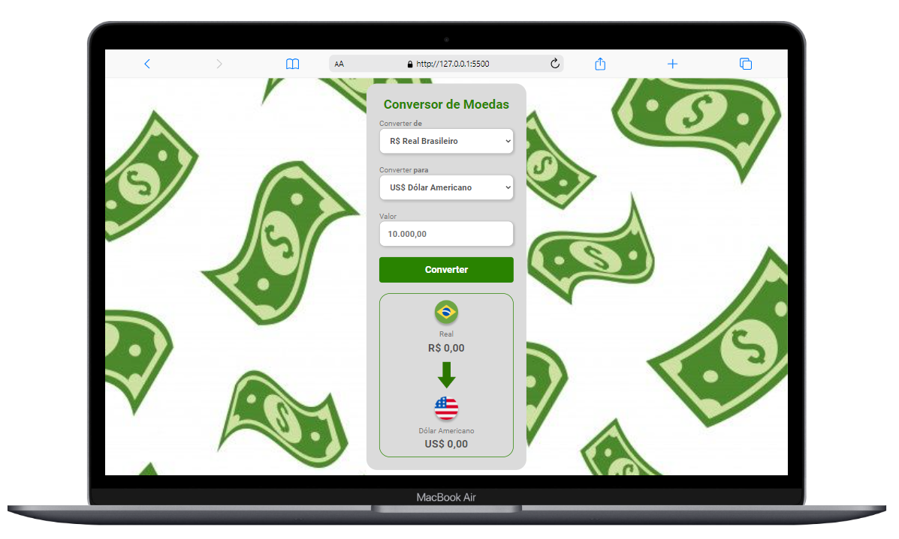

<h1 align="center"> Conversor de Moedas </h1>

 

## Sobre o projeto

Esse projeto foi desenvolvido durante as aulas iniciais de Javascript do <a href="https://rodolfomori.com.br/devclub/">DevClub</a>. Onde foi possivel visualizar o conteúdo teorico na pratica, usando essa linguagem de programação podemos por interação do usuário no site.
 
Nesse projeto foi utilizado os softwares vscode e figma para desenvolvimento. E além disso colocamos a nossa criatividade a prova e também o pensamento logico.
 

## 💻Tecnologias utilizadas

## Desktop

 

  
## Mobile
 

